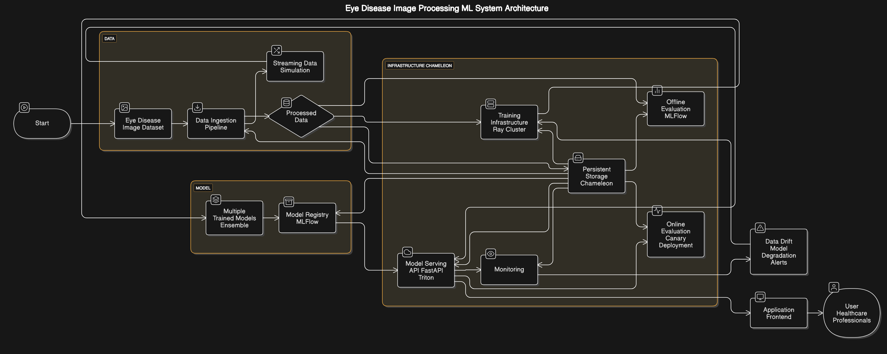

## Automated Eye Disease Detection System for Enhanced Clinical Diagnostics

#### Value Proposition:
Our project focuses on developing a machine learning system that seamlessly integrates into the existing diagnostic framework within eye hospitals and clinics. We're not trying to create a new business; instead, we're aiming to augment the capabilities of current medical practices. This system will analyze retinal images, providing ophthalmologists with an automated tool to aid in the early and accurate detection of a range of eye diseases, including Retinitis Pigmentosa, Retinal Detachment, Pterygium, Myopia, Macular Scar, Glaucoma, Disc Edema, Diabetic Retinopathy, and Central Serous Chorioretinopathy. 

#### Current Status Quo:
Currently, the diagnosis of these diseases relies heavily on manual examination by specialists, a process that can be time-consuming and subjective. Even with advanced imaging technologies like fundus photography and OCT, the interpretation of these images demands significant expertise, often leading to delays in diagnosis. Our system aims to streamline this process, providing quick and consistent analysis to support clinicians in making informed decisions.

#### Business Metric:
The success of our system will be judged on its ability to improve the efficiency and accuracy of eye disease diagnosis. To quantify this, we'll focus on several key business metrics. First, we'll measure the reduction in "time to diagnosis," comparing the time taken to reach a diagnosis with our automated system versus the current manual process. Secondly, we'll assess the "diagnostic accuracy" by determining the concordance rate between our system's predictions and the gold standard diagnosis provided by ophthalmologists. We'll also examine the system's "sensitivity and specificity," ensuring it accurately identifies both positive and negative cases. Additionally, we'll track the "throughput" of our system, which refers to the number of images processed per unit time, to gauge its efficiency in a clinical setting. Finally, and perhaps most importantly, we will focus on the "reduction of false negatives". A false negative could have dire consequences for a patient, and reducing these instances is a paramount concern for our system’s success. By focusing on these metrics, we aim to demonstrate the tangible benefits of our machine learning system in improving patient care and clinical workflows.

### Contributors

<!-- Table of contributors and their roles. 
First row: define responsibilities that are shared by the team. 
Then, each row after that is: name of contributor, their role, and in the third column, 
you will link to their contributions. If your project involves multiple repos, you will 
link to their contributions in all repos here. -->

| Name             | Responsible for                                                                 | Link to their commits in this repo                                                                 |
|------------------|----------------------------------------------------------------------------------|------------------------------------------------------------------------------------------------------|
| Rushabh Bhatt    | CI/CD, Infrastructure as Code, Version Control, Proactive Monitoring and Logging | https://github.com/rushxbh910/Automated-Eye-Disease-Detection-System/commits/main?author=rushxbh910        |
| Shruti Bora      |   Train and Re-train, Training Strategies for Large Models, Scheduling Training Jobs  |  https://github.com/rushxbh910/Automated-Eye-Disease-Detection-System/commits/main/?author=sb9880   |
| Aryan Ajmera     |        model serving and metrics monitoring                                                                          |       https://github.com/rushxbh910/Automated-Eye-Disease-Detection-System/commits?author=AryanAjmera18                                                                                               |
| Vaibhav Rouduri  | Persistent Storage, Offline Data, Data Pipelines, Online Data, Interactive Data Dashboard | https://github.com/rushxbh910/Automated-Eye-Disease-Detection-System/commits/main/?author=vaibhavrouduri                                                                                             |

### System diagram

### Summary of outside materials

<!-- In a table, a row for each dataset, foundation model. 
Name of data/model, conditions under which it was created (ideally with links/references), 
conditions under which it may be used. -->

|                              | How it was created | Conditions of use |
|------------------------------|--------------------|-------------------|
| Eye Disease Image Dataset    | A total of 5335 images of healthy and affected eye images were collected from Anwara Hamida Eye Hospital in Faridpur and BNS Zahrul Haque Eye Hospital in Faridpur district with the help of the hospital authorities. Then from these original images, a total of 16242 augmented images are produced by using Rotation, Width shifting, Height shifting, Translation, Flipping, and Zooming techniques to increase the number of data.                     |You can share, copy and modify this dataset so long as you give appropriate credit, provide a link to the CC BY license, and indicate if changes were made, but you may not do so in a way that suggests the rights holder has endorsed you or your use of the dataset. Note that further permission may be required for any content within the dataset that is identified as belonging to a third party.                   |
| Reference for the above      | Riadur Rashid, Mohammad ; Sharmin, Shayla ; Khatun, Tania; Hasan, Md Zahid; Shorif Uddin , Mohammad  (2024), “Eye Disease Image Dataset”, Mendeley Data, V1, doi: 10.17632/s9bfhswzjb.1                   |                   |
| Base model 1                 |  Convolutional Neural Networks (CNNs)| Custom CNN: CNN from scratch with multiple convolutional layers, batch normalization, and dropout for regularization.
|| | EfficientNet (B0-B7): This model is optimized for image classification and provides a good balance between accuracy and efficiency.
|||ResNet (ResNet-50): The residual connections help train deep networks effectively.|
| | Vision Transformers (ViTs)| This model captures long-range dependencies and performs well on large datasets.

### Summary of infrastructure requirements

<!-- Itemize all your anticipated requirements: What (`m1.medium` VM, `gpu_mi100`), 
how much/when, justification. Include compute, floating IPs, persistent storage. 
The table below shows an example, it is not a recommendation. -->

 | Requirement                                             | How many/when                     | Justification                                    |
 |---------------------------------------------------------|-----------------------------------|--------------------------------------------------|
 | gpu_p100_nvlink/ gpu_a100_pcie/ gpu_v100/ gpu_a100_pcie | approximately for 20 hours        | Image Dataset of 4GB needs high processing power |
 | gpu_v100 | 	1-2 GPUs for real-time inference                 |   Ensures low-latency model serving with a target of <200ms per image.        |
 | gpu_p100/ gpu_mi100/ compute_liqid                      | approximately for 45 hours        | Incase 4 core GPU server not available           |
 | Floating IPs                                            | 3 for entire project duration     |                                                  |
 

### Detailed design plan

<!-- In each section, you should describe (1) your strategy, (2) the relevant parts of the 
diagram, (3) justification for your strategy, (4) relate back to lecture material, 
(5) include specific numbers. -->

#### Model training and training platforms

<!-- Make sure to clarify how you will satisfy the Unit 4 and Unit 5 requirements, 
and which optional "difficulty" points you are attempting. -->

<!-- Make sure to clarify how you will satisfy the Unit 4 and Unit 5 requirements, 
and which optional "difficulty" points you are attempting. -->
###### Model Training at Scale
A. Train and Re-train
We will train a convolutional neural network (CNN)-based image classification model on eye disease dataset. The model will be retrained periodically using new production data to adapt to evolving patterns.
The CNN model is chosen for its efficiency in image classification tasks. We will experiment with different architectures (ResNet, EfficientNet) to compare accuracy and training time.
B. Training Strategies for Large Models (Difficulty Point)
If the model doesn’t fit on a single low-end GPU, we will implement Distributed Data Parallel (DDP) or Fully Sharded Data Parallel (FSDP) to enable multi-GPU training. We will analyze the impact of batch size adjustments and gradient accumulation on training efficiency.
C. Distributed Training for Faster Training (Difficulty Point)
We will compare training time on one GPU vs. multiple GPUs using DDP (data parallel training) and FSDP (sharded gradients). A plot of training time vs. GPU count will be included in our report.

######  Meeting Unit 5 Requirements: Model Training Infrastructure & Platform
A. Experiment Tracking
We will self-host an MLFlow/W&B server on Chameleon to track training metrics, hyperparameters, and model performance. Logging will be integrated into our training code to store all experiments.
B. Scheduling Training Jobs
A Ray cluster will be set up for training job scheduling. Model training will be submitted as a job in a continuous training pipeline.
Ray Train for fault tolerance & checkpointing:
We will try to incorporate Ray Train in the training process that will support automatic failure recovery. 
Hyperparameter Tuning with Ray Tune:
Advanced tuning algorithms (Bayesian optimization, ASHA) will be used for efficient hyperparameter search. A comparison of different tuning methods will be presented.

#### Model serving and monitoring platforms

For our Automated Eye Disease Detection System, model serving is a critical aspect that must strike a balance between low-latency inference and high diagnostic precision. Given the requirement for real-time decision-making support in clinical diagnostics, our serving architecture will support both online inference for real-time predictions and bulk inference for mass retrospective analysis. We will deploy our model using containerized microservices to ensure modularity and scalability, leveraging MLflow integrated with DagsHub for efficient version control and collaborative model management. Model quantization and pruning will be explored to optimize performance, with quantization-aware training minimizing accuracy loss while improving inference speed.

Our deployment strategy is based on Chameleon Cloud with flexible hosting coupled with native monitoring and dynamically adjusting resources. For maintaining low costs, we will implement auto-scaling policies that dynamically shift resource allocation based on usage patterns. System-level optimisations will comprise concurrent image processing batching dynamically, avoiding cold start by warming up instances of the model, parallel model execution to test robustness, and model ensemble to boost accuracy.

Continuous monitoring will be crucial to maintain top performance in the long term, tracking operational metrics such as inference latency (target <200ms), system throughput, and infrastructure utilization, as well as prediction quality metrics such as sensitivity, specificity, and false negatives. Drift detection mechanisms will identify covariate shift in input distribution, concept drift in model behavior, and lagging ground truth labels via routine validation.

Automated retraining pipelines will incorporate fresh data in a weekly retrain schedule, with shadow testing to compare new models against production models and canary testing for phased rollouts. Active logging and monitoring will leverage MLflow and DagsHub for real-time anomaly detection, versioning, and troubleshooting. The products will provide automated model performance monitoring, drift detection, and shared monitoring for team-level model updates. By combining robust serving abilities with intensive monitoring, our system will be extremely reliable, efficient, and accurate, and thus a good project to demonstrate cloud-based AI-powered diagnostics

#### Data pipeline

<!-- Make sure to clarify how you will satisfy the Unit 8 requirements,  and which 
optional "difficulty" points you are attempting. -->

The data pipeline for this project is designed to support both offline and online workflows. The Eye Disease Image Dataset, consisting of 16,242 pre-augmented eye images, serves as the primary source of offline data. This dataset is treated as unstructured image data and is stored in a persistent storage provisioned on Chameleon. The persistent storage is mounted to the infrastructure as needed and is used to retain all relevant project artifacts, including datasets, model checkpoints, training logs, and container images that are not tracked in version control.

The offline pipeline is implemented as an ETL (Extract, Transform, Load) process. It ingests the raw dataset, applies preprocessing operations such as image normalization, resizing, and format standardization, and loads the processed data into the storage backend in a format suitable for model training and evaluation. This ensures data consistency across training iterations and enables efficient reuse.

In the online pipeline a streaming data simulation mechanism is implemented. A subset of the dataset is reserved for this purpose to ensure that simulation does not reuse data seen during training or validation and there is no data leakage. These simulation images are sent over time at fixed intervals, mimicking real-time data arrival patterns. The simulation pipeline applies the same preprocessing operations as the offline pipeline, ensuring consistency across inference modes. This real-time data is sent to the deployed model inference service and used to evaluate system behavior under live conditions. The setup enables comprehensive testing of model responsiveness, throughput, and performance monitoring, including the detection of drift and degradation.

#### Continuous X

To ensure the robust and consistent operation of our system, we are implementing a comprehensive continuous integration and continuous deployment (CI/CD) strategy, leveraging the capabilities of GitHub Actions. Firstly, we will employ Infrastructure as Code (IaC) principles, utilizing Terraform to define and manage our cloud infrastructure. This approach allows for version control of our infrastructure configurations, ensuring reproducibility and consistency across environments. Containerization, facilitated by Docker, will be used to encapsulate all application services, promoting portability and simplifying deployment. A GitHub Actions workflow will automate the build, test, and deployment processes, minimizing manual intervention and reducing the potential for human error. We are adopting a microservices architecture to enhance modularity and scalability, enabling independent deployment and management of system components. Furthermore, an immutable infrastructure paradigm will be followed, where changes are implemented through updates to the Terraform configuration rather than direct modifications to deployed resources. All code and configuration artifacts will be managed via Git, providing a complete audit trail and facilitating collaboration.

Automated configuration, using tools such as Ansible or python-chi, will streamline the setup and deployment of software components. We will establish staged deployment environments, specifically staging, canary, and production, to enable rigorous testing and controlled releases. The infrastructure components, including training, serving, and monitoring, will be orchestrated using Terraform. The GitHub Actions workflow will automate the data flow, and monitoring will be integrated to provide proactive feedback. This approach is justified by the need for reproducible infrastructure, consistent deployments, automated workflows, and early detection of issues. It also aligns with the principles and tools discussed in Unit 3, such as Terraform, Docker, and GitHub Actions. We will maintain three distinct environments and aim for weekly retraining and redeployment cycles. All configurations and code will be maintained in a Git repository within GitHub.
